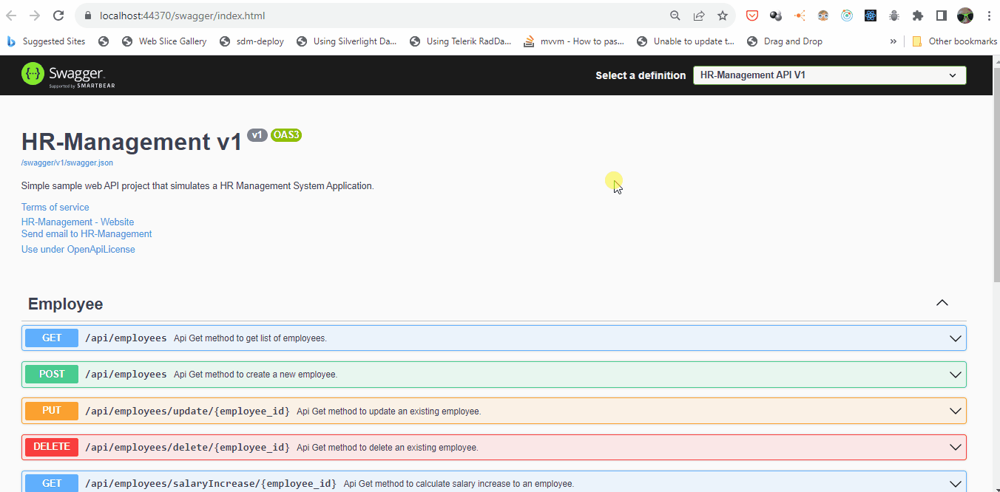

# 👥HR-Management

## 📖Description

HR-Management is a simple sample web API project that simulates a HR Management System Application.



### 🏗️Built With

- [.NET Core 3.1](https://dotnet.microsoft.com/en-us/download/dotnet/3.1)
- [Dapper](https://www.nuget.org/packages/Dapper/)
- [Microsoft.Data.SqlClient](https://www.nuget.org/packages/Microsoft.Data.SqlClient/5.1.1)

## Table of Contents:

- 📋 [Prerequisites](#Prerequisites)
- 🚀 [Installation](#installation)

### 📋 Prerequisites

1. First you need to check if you have installed the .NET Core 3.1 SDK with the following .NET CLI (Command-Line Interface) command:

   ```sh
   dotnet --version
   ```

   If your version is not 3.1, [download the .NET Core 3.1 SDK](https://dotnet.microsoft.com/en-us/download/dotnet/3.1) and install it on your machine.

2. Have Visual Studio 2019 installed.

3. Have an instance of MSSQLSERVER installed and running.

## 🚀 Installation

This section provide a step-by-step description of how to get the development environment running.

1. Clone the repo with the following command.
   ```sh
   git clone https://github.com/potlitel/HR-Management.git
   ```
2. Position yourself inside the newly cloned repo folder.
   ```sh
   cd HR-Management
   ```
3. Execute the following command
   ```sh
   dotnet restore
   ```
4. Open the project solution file (HR-Management.sln) using Visual Studio.

5. Right click on the 'HR-Management-Database' Database project and click on the 'Publish...' option. Remember to modify the connection string (appsettings.json) according to your environment. Make sure that the output of this command is similar to the following:

   ```sh
   Publish completed successfully
   ```

6. Run the project 'HR-Management-WebAPI' and voila, enjoy it.


